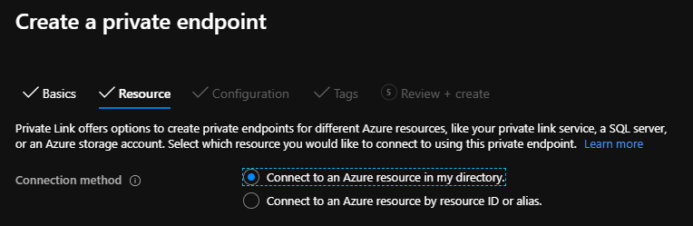
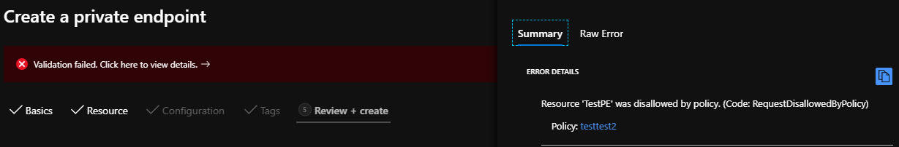

# Azure Private Link Governance and RBAC
Guidance on the use of Azure Policy and Azure Role Based Access Control (RBAC) when working with Azure Private Link

# A quick note on the use of RBAC and Azure Policy

-	**Azure Role-based Access Control (RBAC)** is the right tool when you want to manage a user's access to perform actions or operations that are available within a specific [Azure Resource Provider](https://docs.microsoft.com/en-us/azure/role-based-access-control/resource-provider-operations). This document provides examples of using RBAC to control access to actions available within the resource type *Private Endpoints*, which resides within the resource provider *Microsoft.Network*. 

- **Azure Policy** is the right tool when you want to define what a resource looks like. I.e. My user has passed through the first 'gate' (RBAC), (They have the required permissions to start the resource creation), but what additional controls do I want to apply to define what a compliant resource can look like based on its Resource Manager properties? A common scenario is; *"yes this user can create Virtual Machines (VM), but they can only create VM types with SKUs X, Y and Z"*.

In short, we should consider both RBAC and Azure Policy tools that complement  each other when approaching cloud governance, and we will apply this methodology to the discussion below in relation to Azure Private Link.

# Introduction

## Multiple points of security enforcement

This document is not an exhaustive explanation of Azure Private Link as a technology. If you are new to this area, I suggest starting with the video available at aka.ms/whatisprivatelink or at the official Azure Docs page [here](https://docs.microsoft.com/en-us/azure/private-link/private-link-overview). Use of Private Link involves the creation of Private Endpoints (PE) inside of a customer Virtual Network (VNet). These PE can be used to provide access to resources both inside, and outside of the customers Azure Active Directory tenant. The ability to create the Private Endpoint resource itself is just step-1 of the workflow required to facilitate end-to-end access:

1) Setup the Private Endpoint (PE) itself (the focus of this document). This is referred to as the *consumer* side of the connection.
2) Approve the Private Link connection on the *provider* side; this could be a Private Link Service (PLS) within another Azure VNet, or more frequently, an Azure PaaS resource such as Azure SQL. This step can be automatically approved (if attaching to a resource inside of the same Azure AD tenant) or require manual approval by a user with appropriate RBAC permission on the provider side.
3) With Steps 1 and 2 complete, the user can make a network level connection to the PaaS resource; the *Private Link* connection is complete. The next step is the normal provider side challenge to authenticate the client; examples of this include inputting a username and password for an Azure SQL Server, or being in possession of the required shared access signature (SaS) token for access to a storage account.

Private Link does not change or circumnavigate any pre-existing provider side controls for authentication. A defense-in-depth approach to PaaS security has to account for the entire spectrum of available security controls; **Governance controls** via RBAC and Azure Policy, **Network-level controls** such as Network Security Groups (NSG) filtering and Firewall/NVA placement and **Provider-side security controls** that vary dependant on the PaaS service in use (E.g. authentication, identity management, encryption-at-rest and key management/rotation).

## Why do some customers wish to implement highly secure governance for Private Link?

Dependant on the industry and sector within which a company resides, we observe differing approaches to security and governance in the cloud. For example, companies within highly regulated industries such as health care and finance may be required to enforce stricter levels of control on internal users administering their cloud service provider (CSP) environment. 

This focus on security often manifests itself as restricting the operation of the CSP environment using fine-grained access management (via RBAC) and limiting the possible scope of resource options to an internal approved 'shopping list' (via Azure Policy); see example above relating to VM SKU types. The overall goal being to limit the possible risk of human error or malicious intent resulting in the exposure of the company's internal data to users without the appropriate authorisation; either on the Internet, or within another customer residing on the CSP.

Such customers may already restrict the use of other Network resources inside of Azure, such as VPN Gateways, Public IPs and VNet Peering; ensuring that they are only used within their Azure AD tenant, and restricting their use for connectivity outside of their private Virtual Networks (VNets). These customers may then desire to apply a similar logic to Azure Private Link. This creates a requirement to govern the use of steps 1 and 2 above, as an additional layer of security, to be combined with the inherent security of the provider side controls in step 3.

# Creating a Private Endpoint

Let’s first review the options presented when setting up a Private Endpoint, as shown in the figure below.


 
## Option 1 - “Connect to an Azure resource in my directory” 

This option lists the Microsoft PaaS resources available for connection within subscriptions under the common local Azure Active Directory tenant. This requires that a user creating the Private Endpoint has the following permissions assigned to them:

| Permission | Function |
| ------------- | ------------- |
| Microsoft.Network/privateEndpoints/write/action  | Create a Private Endpoint on consumer side  |
| Microsoft.Network/location/availablePrivateEndpointTypes/read/action  | To list the available Private Endpoint resource types  |
| Microsoft.[RP]/[resourceType]/read/action  | To list the resources from a given type  |
| Microsoft.[RP]/[resourceType]/privateLinkResources/read/action  | To list the sub-resources from a given resource  |
| Microsoft.[RP]/[resourceType]/privateEndpointConnectionApproval/action  | To approve the provider side Private Link setup[1] |

*Note1. If the user creating the Private Endpoint has this permission, then the provide side connection will be automatically approved during PE creation.

### :point_right: Hint 

**When using this first option for Private Endpoint creation, the PrivateLinkServiceConnection object is used within the API call to create this service.**

## Option 2 - “Connect to an Azure resource by resource ID or alias” 

This option is used to connect to resources outside of the local common Active Directory tenant. Examples of which could be an Azure SQL database owned by another organisation (providing you know the resource ID or alias), or a Private Link Service (PLS) running in any Azure VNet (regardless of Azure AD tenant under which that VNet resides). 

### :point_right: Hint 

**When using this second option for Private Endpoint creation, the *manual*PrivateLinkServiceConnection object is used within the API call to create this service.**

# Using Azure Policy to control the creation of Private Endpoints

## Scenario 1 - Block the creation of Private Endpoints to resources outside of my Azure Active Directory tenant

As presented above, in order to establish an Azure Private Link connection to a resource outside of the current Azure AD tenant, the user must make an API call using the following construct. The key differentiator here is the use of the *manual*PrivateLinkServiceConnections object, which differentiates this from the API call used when establishing a Private Link connection to a resource listed within your Azure AD tenant. 

```json
"resources": [
        {
            "location": "[parameters('location')]",
            "name": "[parameters('privateEndpointName')]",
            "type": "Microsoft.Network/privateEndpoints",
            "apiVersion": "2020-03-01",
            "properties": {
                "subnet": {
                    "id": "[parameters('subnet')]"
                },
                "manualPrivateLinkServiceConnections": [
                    {
                        "name": "[parameters('privateEndpointName')]",
                        "properties": {
                            "privateLinkServiceId": "[parameters('privateLinkResource')]",
                            "groupIds": "[parameters('targetSubResource')]",
                            "requestMessage": "[parameters('requestMessage')]"
                        }
                    }
                ]
            },
            "tags": {}
        }
    ]

```

We can use this differentiator as a condition inside of a custom Azure Policy definition file to support restricting the use of this option, as shown below. Very simply, if an API call is made using the field "manualPrivateLinkServiceConnections", this is blocked.

```json
{
  "mode": "All",
  "policyRule": {
    "if": {
      "allOf": [
        {
          "field": "type",
          "equals": "Microsoft.Network/privateEndpoints"
        },
        {
          "field": "Microsoft.Network/privateEndpoints/manualPrivateLinkServiceConnections",
          "exists": "true"
        }
      ]
    },
    "then": {
      "effect": "deny"
    }
  },
  "parameters": {}
}

```

## Scenario 2 - Block the creation of Private Endpoints to resources outside of current subscription

In a similar vein to Scenario #1, a more restrictive requirement may exist to prevent the use of Private Link for access to provider side resources outside of a specific subscription. The following custom Azure Policy definition file accomplishes this by inspecting the contents of the field *Microsoft.Network/privateEndpoints/manualprivateLinkServiceConnections[*].privateLinkServiceId* (this field contains the resource ID of the provider side service). As all resource IDs contain the parent subscription ID, we are able to leverage this attribute to validate if it matches, in this case, the current subscription (*[subscription().id]*). 

```json
{
  "mode": "All",
  "policyRule": {
    "if": {
      "allOf": [
        {
          "field": "type",
          "equals": "Microsoft.Network/privateEndpoints"
        },
        {
          "field": "Microsoft.Network/privateEndpoints/manualprivateLinkServiceConnections",
          "exists": "true"
        },
        {
          "field": "Microsoft.Network/privateEndpoints/manualprivateLinkServiceConnections[*].privateLinkServiceId",
          "notcontains": "[subscription().id]"
        }
      ]
    },
    "then": {
      "effect": "deny"
    }
  },
  "parameters": {}
}

```

## Scenario 3 - Block the creation of Private Endpoints to resources outside of a list of subscriptions

Expanding on Scenario #2, a requirement may exist to prevent the use of Private Link for access to provider side resources outside of a specific list of subscriptions. The following custom Azure Policy definition file accomplishes this by inspecting the contents of the field *Microsoft.Network/privateEndpoints/manualprivateLinkServiceConnections[*].privateLinkServiceId* (this field contains the resource ID of the provider side service) and checking for the presence of a subscription ID contained within an array parameter. There is some extra manipulation of the field using the *count* and *split* functions, to account for the inability to use *In* or *NotIn* conditions when working with arrays.

```json
{
  "mode": "All",
  "policyRule": {
    "if": {
      "count": {
        "field": "Microsoft.Network/privateEndpoints/manualprivateLinkServiceConnections[*]",
        "where": {
          "allOf": [
            {
              "field": "Microsoft.Network/privateEndpoints/manualprivateLinkServiceConnections[*].privateLinkServiceId",
              "notEquals": ""
            },
            {
              "value": "[split(concat(first(field('Microsoft.Network/privateEndpoints/manualprivateLinkServiceConnections[*].privateLinkServiceId')), '//'), '/')[2]]",
              "notIn": "[parameters('allowedSubscriptions')]"
            }
          ]
        }
      },
      "notEquals": 0
    },
    "then": {
      "effect": "deny"
    }
  },
  "parameters": {
    "allowedSubscriptions": {
      "type": "Array",
      "metadata": {
        "displayName": "Allowed subscriptions",
        "description": "A list of subscriptions IDs"
      },
      "allowedValues": [
        "abc12345-abc1-abc1-abc1-abc123456789",
        "bbc12345-abc1-abc1-abc1-abc123456789",
        "sub-N"
      ],
      "defaultValue": [
        "abc12345-abc1-abc1-abc1-abc123456789"
      ]
    }
  }
}

```

# Validation failure UI example

With the Azure Policy custom definition in place and assigned to the required subscription, if a user attempts to create a Private Endpoint that is in violation of this policy, an error such as the below is shown within the portal.



# Closing

Thanks to fellow Microsoft FTE for dialogue and assistance with the above

- Ben Hummerstone for Azure Policy testing
- Shaf Mahmood for Azure Policy support relating to split function
- Marc de Droog, Federico Guerrini and Jochen van Wylick for technical review


 


